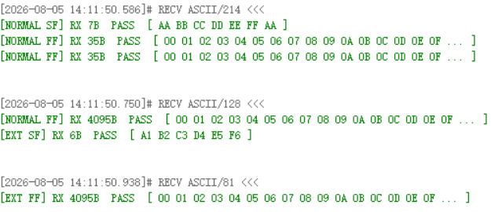
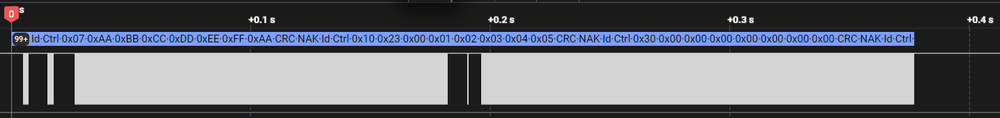
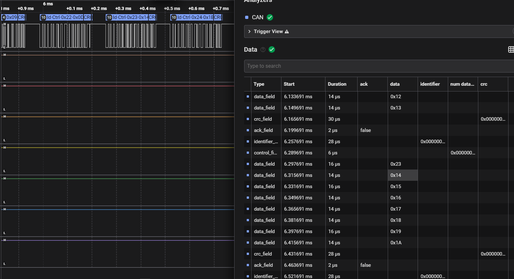
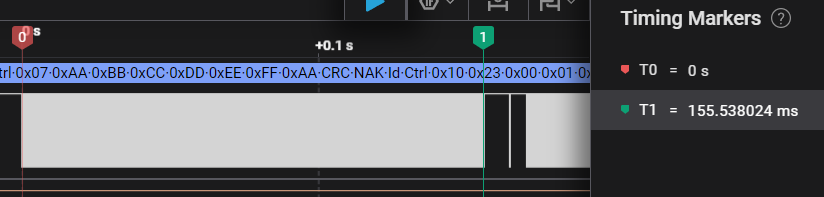
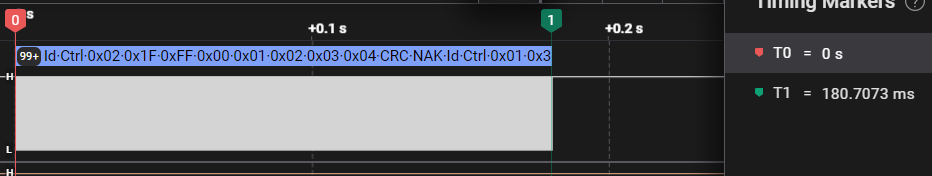

# EasyCantp

> A lightweight CAN TP (ISO 15765-2) protocol stack for resource-constrained microcontrollers 
> No AUTOSAR.
>
> 基于 ISO 15765-2 的 CANTP 嵌入式轻量化协议栈，No AUTOSAR. 适合资源受限的微控制器.

---

## 特性

- **静态连接池管理**，无动态内存（`malloc`/`free`）分配操作.
- **ISR解耦**：中断只做确定性操作（拷贝、状态更新），用户注册回调均运行在任务上下文.
- **支持双寻址模式**：NORMAL（11-bit CAN ID）+ EXT（TA 在数据场）、功能寻址
- **双物理层**：支持 Classic CAN（8 字节）/ CAN FD（12~64 字节）.
- **完整的流控**：实现BS 块大小、STmin 帧间隔、OVERFLOW 中止.
- **可移植**：协议栈内部解耦具体硬件操作，纯C代码，可移植多种类型MCU.

---

## 架构

```
ctp.h                     ← 用户只需 #include 这一个
 ├── ctp_types.h          类型、枚举、回调、ASSERT、时序常量
 ├── ctp_frame.h / .c     帧组装 & 解析 (SF / FF / CF / FC)
 ├── ctp_timer.h / .c     软件定时器 (Start / Stop / Expired)
 ├── ctp_channel.h / .c   寻址 & DLC 转换
 ├── ctp_conn.h / .c      连接池 & 生命周期 (Create / Release / Find)
 └── ctp_fsm.h / .c       主状态机 (StartTransmit / FeedFrame / TxConfirm / MainFunction)
```

---

## 快速开始

### 1. 配置

在 `#include "ctp.h"` 之前定义（可选，不定义则使用默认值）：

```c
#define CUS_CANTP_MAX_TX   2    /* TxConn 池大小            */
#define CUS_CANTP_MAX_RX   2    /* RxConn 池大小            */
#define CUS_CANTP_TIMEOUT_N_AS  1000U
#define CUS_CANTP_TIMEOUT_N_BS  5000U
#define CUS_CANTP_TIMEOUT_N_AR  1000U
#define CUS_CANTP_TIMEOUT_N_CR  1000U
```

### 2. 实现三个回调

```c
/* 此处以 STM32F1 移植作为示例. */
/* CAN 发送 — 返回识别tag(STM32中为邮箱号)（≥0）或 -1（失败） */
int8_t MySendFunc(void *ctx, uint32_t canId, const uint8_t *data, uint8_t dlc) {
    uint32_t mailBox = 0;
    if ( HAL_CAN_AddTxMessage( ..., &mailBox ) != HAL_OK )
        return -1;
    return (int8_t)mailBox;
}

/* 接收完成通知 */
void MyDataInd(void *rxConn, const uint8_t *data, uint32_t len) {
    /* 处理 data[0..len-1] */
}

/* 错误通知 */
void MyErrCb(void *conn, Cus_CANTP_ErrCode_t err) {
    /* 处理 err */
}
```

### 3. 创建连接

```c
Cus_CANTP_ChannelCfg_t chtx = {
    .addrMode = CUS_CANTP_ADDR_MODE_NORMAL,		/* 普通寻址模式 */
    .SA       = 0x02,						  /* 自身连接地址(对于Tx) */ 
    .TA       = 0x01,						  /* 目标连接地址(对于Tx) */
    .fSize    = CUS_CANTP_SIZE_8,			   /* TX_DLC. 必须>=8. 对于Classic CAN为8. */ 
};

const Cus_CANTP_TxConn_t *tx = Cus_Cantp_CreateTxConn(chtx, &hcan1, &app,
                                                        MySendFunc, MyErrCb);

Cus_CANTP_ChannelCfg_t chrx = {
    .addrMode = CUS_CANTP_ADDR_MODE_NORMAL,		/* 普通寻址模式 */
    .SA       = 0x00,						  /* 监听发送方地址(非0表示只接收来自指定发送方的报文) (对于Rx)*/ 
    .TA       = 0x01,						  /* 自身连接地址(对于Rx) */
    .fSize    = CUS_CANTP_SIZE_8,			   /* TX_DLC. 必须>=8. 对于Classic CAN为8. */ 
};
const Cus_CANTP_RxConn_t *rx = Cus_Cantp_CreateRxConn(chrx, &hcan1, &app,
                                                        MySendFunc, MyErrCb);
uint8_t rxBuf[256];
Cus_Cantp_RxConnBindBuf((Cus_CANTP_RxConn_t *)rx, rxBuf, sizeof(rxBuf),
                         8, 0, MyDataInd);   /* BS=8, STmin=0 */
```

### 4. 中断

```c
/* SysTick — 1ms 调用一次 */
void SysTick_Handler(void) { Cus_Cantp_TimerTickInc(); }

/* CAN RX 中断 */
void CAN_RX_IRQHandler(void) {
    uint8_t data[64]; uint32_t canId; uint8_t dlc;
    HAL_CAN_GetRxMessage(&hcan1, ..., &canId, data, &dlc);
    Cus_Cantp_FeedFrame(canId, data, dlc);
}

/* CAN TX 完成中断 */
void CAN_TX_IRQHandler(void) {
    uint32_t mb = HAL_CAN_GetTxMailbox(...);
    Cus_Cantp_TxConfirm(&hcan1, mb);
}
```

### 5. 任务循环

```c
void Task_CANTP(void) {
    while (1) {
        Cus_Cantp_MainFunction();		/* 推动 CANTP 主状态机. */
        vTaskDelay(pdMS_TO_TICKS(5));   /* 5ms 周期 */
    }
}
```

### 6. 发送数据

```c
uint8_t payload[] = "Hello CAN TP!";
int8_t rc = Cus_Cantp_StartTransmit((Cus_CANTP_TxConn_t *)tx, payload, sizeof(payload));
if (rc == 1) {
    while (tx->state != CUS_CANTP_STA_IDLE) {
        vTaskDelay(pdMS_TO_TICKS(1));   /* 等发送完成 */
    }
}
```

---

## API 参考

### 帧操作 (`ctp_frame.h`)

| 函数 | 说明 |
|---|---|
| `Cus_Cantp_BuildSF(frame, fs, off, data, len)` | 组装单帧 |
| `Cus_Cantp_BuildFF(frame, fs, off, data, totLen)` | 组装首帧 |
| `Cus_Cantp_BuildCF(frame, fs, off, data, rem, sn, &copied)` | 组装连续帧 |
| `Cus_Cantp_BuildFC(frame, fs, off, flowState, bs, stmin)` | 组装流控帧 |
| `Cus_Cantp_ParseSF/FF/CF/FC(...)` | 解析各帧类型 |
| `Cus_Cantp_GetPciType(frame, off)` | 获取帧类型（SF/FF/CF/FC） |

### 定时器 (`ctp_timer.h`)

| 函数 | 说明 |
|---|---|
| `Cus_Cantp_TimerInit()` | 初始化全局 tick（可选，静态变量默认 0） |
| `Cus_Cantp_TimerTickInc()` | 驱动 tick（SysTick ISR 中调用） |
| `Cus_Cantp_TimerStart(t, ms)` | 启动一次性定时器 |
| `Cus_Cantp_TimerStop(t)` | 停止定时器 |
| `Cus_Cantp_TimerExpired(t)` | 查询是否超时（回绕安全） |
| `Cus_Cantp_TimerActive(t)` | 查询是否已启动 |
| `Cus_Cantp_TimerNow()` | 获取当前 tick 值 |

### 寻址 (`ctp_channel.h`)

| 函数 | 说明 |
|---|---|
| `Cus_Cantp_GenerateId(mode, ta, sa, taType, funcId)` | 构造 CAN ID |
| `Cus_Cantp_ExtractSA(mode, canId)` | 从 CAN ID 提取 SA |
| `Cus_Cantp_WriteAddrPrefix(frame, cfg)` | EXT 模式写 TA 到数据场 |
| `Cus_Cantp_GetPciOffset(mode)` | 获取 PCI 偏移量（内联） |
| `Cus_Cantp_SizeToLinkLayerDLC(fs)` | 帧字节数 → DLC |
| `Cus_Cantp_LinkLayerDLCToSize(dlc)` | DLC → 帧字节数 |

### 连接池 (`ctp_conn.h`)

| 函数 | 说明 |
|---|---|
| `Cus_Cantp_ConnPoolInit()` | 初始化连接池 |
| `Cus_Cantp_CreateTxConn(cfg, dev, ctx, send, err)` | 创建发送连接 |
| `Cus_Cantp_CreateRxConn(cfg, dev, ctx, send, err)` | 创建接收连接 |
| `Cus_Cantp_RxConnBindBuf(rx, buf, size, bs, stmin, ind)` | 绑定接收缓冲区 |
| `Cus_Cantp_ReleaseConn(conn, type)` | 释放连接回池 |
| `Cus_Cantp_FindTxByTag / FindRxByTag(dev, tag)` | 按 指定设备的 tag 查找（TxConfirm） |
| `Cus_Cantp_FindTxById / FindRxById(canId, frame)` | 按 CAN ID 查找（FeedFrame） |

### 状态机 (`ctp_fsm.h`)

| 函数 | 上下文 | 说明 |
|---|---|---|
| `Cus_Cantp_StartTransmit(tx, data, len)` | Task | 发起传输 |
| `Cus_Cantp_MainFunction()` | Task | 主状态机驱动 |
| `Cus_Cantp_FeedFrame(canId, data, dlc)` | ISR | 喂入接收帧 |
| `Cus_Cantp_TxConfirm(dev, tag)` | ISR | 发送完成确认 |
| `Cus_Cantp_TimerTickInc()` | ISR | 系统 tick |

### 回调

| 回调 | 调用上下文 | 说明 |
|---|---|---|
| `Cus_Cantp_SendFunc_t` | Task / MainFunction | 发送 CAN 帧，返回 tag |
| `Cus_Cantp_DataInd_t` | Task / MainFunction | 完整消息接收通知 |
| `Cus_Cantp_ErrCb_t` | Task / MainFunction | 协议错误通知 |

---

## 配置宏

| 宏 | 默认值 | 说明 |
|:-:|:-:|:-:|
| `CUS_CANTP_MAX_TX` | 2 | 最大 TxConn 数量 |
| `CUS_CANTP_MAX_RX` | 2 | 最大 RxConn 数量 |
| `CUS_CANTP_TIMEOUT_N_AS` | 1000 | 发送确认超时 (ms) |
| `CUS_CANTP_TIMEOUT_N_BS` | 5000 | 等待流控超时 (ms) |
| `CUS_CANTP_TIMEOUT_N_AR` | 1000 | FC 发送确认超时 (ms) |
| `CUS_CANTP_TIMEOUT_N_CR` | 1000 | 等待连续帧超时 (ms) |

---

## Benchmark

​	example示例：f1_loopback_demo 测试用例运行示意：

 

​	逻辑分析仪捕获帧概览图：





协议栈性能计算 ( 500K CAN baudrate. )






在 500kbps 经典 CAN 总线上，完成 4095 字节多帧传输的实测耗时：NORMAL 寻址模式（有效载荷 7 字节/帧）为 155.55ms（587 帧），EXT 寻址模式（有效载荷 6 字节/帧）为 180.00ms（684 帧）。理论无填充极限分别为 126.6ms 和 147.7ms，实测差值主要来自 CAN 协议固有的位填充开销（随机数据下约 22%）及帧间隔（IFS），折算后两种模式的有效吞吐量分别为 26.3KB/s 和 22.8KB/s，总线利用率均稳定在 82% 左右。

实测数据表明协议栈本身未引入显著软件开销，性能接近 CAN 物理层极限。

------

## 许可证

MIT License. Copyright (c) 2026 R6bandito.
